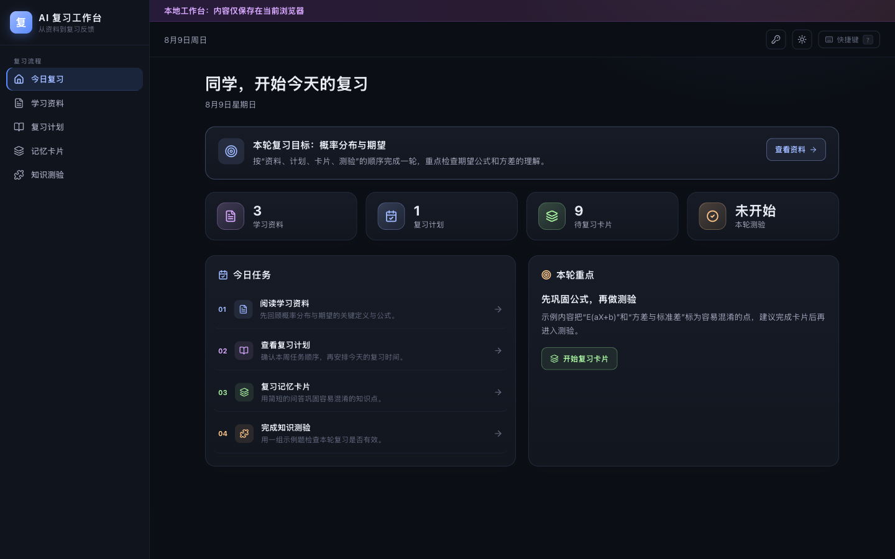

# AI 复习工作台 📚

AI 复习工作台是一款围绕个人复习闭环设计的轻量 Web 应用。它把学习资料、复习计划、记忆卡片、知识测验和薄弱点反馈放在同一个本地工作台中，帮助用户从“已经记了笔记”继续走到“知道下一步该复习什么”。

[在线体验](https://jiaxuan-tao.github.io/vibe-coding-lab/ai-review-workspace/) · [使用方法](#使用方法) · [AI 与本地数据](#ai-与本地数据) · [能力边界](#能力边界)



## 产品预览

首页按照“学习资料 → 复习计划 → 记忆卡片 → 知识测验”组织本轮任务，并在测验完成后展示得分、薄弱知识点和建议回看的资料。首次打开会自动准备一套本地示例内容，不需要注册账号或配置 API Key。

## 它解决什么问题

学习资料往往分散在笔记、任务清单和练习题中。用户即使保存了很多内容，也可能不知道先看什么、如何安排复习，以及做完练习后该回到哪一处补弱点。

这个工作台把复习收敛为一条可重复的路径：

1. 阅读或整理学习资料。
2. 把复习主题拆成分周任务。
3. 用记忆卡片巩固关键概念。
4. 通过三道题检查本轮掌握情况。
5. 根据错题反馈回看薄弱点，并选择下一步行动。

它不是完整的课程管理平台，而是帮助个人完成一轮复习并得到明确反馈的本地工具。

## 使用方法

1. 打开在线版本，应用会直接进入无需登录的示例工作台。
2. 在“学习资料”中搜索、阅读、新建或编辑笔记。
3. 在“复习计划”中输入主题和可选目标日期，创建一份四周计划。
4. 在“记忆卡片”中打开示例卡组，点击卡片查看答案并切换上一张、下一张。
5. 在“知识测验”中完成三道题，查看得分和需要回看的知识点。
6. 返回“今日复习”，根据测验反馈进入对应资料，或继续下一轮卡片和测验。

右上角可以切换深浅主题。AI 设置是可选项；不配置 Qwen Key 也能完整体验本地样例流程。

## 核心功能

- **今日复习**：汇总资料、计划、卡片和测验状态，按固定顺序给出当前任务。
- **学习资料**：支持按标题和正文搜索，新建、编辑、预览及删除浏览器内的笔记。
- **复习计划**：根据复习主题生成四周任务，可在多份计划间切换或删除计划。
- **记忆卡片**：提供确定性的示例卡组与正反面复习交互，也可以新建和删除卡组。
- **知识测验**：提供三道本地样例题，逐题反馈正误并在结束后汇总薄弱知识点。
- **下一步建议**：测验结果会回写首页，引导用户优先回看对应资料。
- **本地体验**：示例资料、计划和卡组只会在对应集合为空时补齐，不会在每次进入时覆盖已有内容。

## AI 与本地数据

项目默认使用确定性的本地样例内容，不需要 API Key，也不会因为缺少 AI 服务而阻断复习流程。

用户可以自行提供个人 Qwen API Key。Key 仅保存在当前浏览器的 `localStorage` 中；保存 Key 后，只有在用户点击“创建计划”或“开始测验”时，浏览器才会把 Key 和相应提示词直接发送到阿里云 DashScope 的 Qwen 兼容接口。请求失败或返回内容不符合预期格式时，应用会自动使用本地样例结果。不要在此处填写团队密钥或项目私钥。

学习资料、复习计划、卡组与卡片、测验反馈、主题和本地偏好同样只保存在当前浏览器。项目没有账号、后端或云同步；清除该站点的浏览器数据会删除这些内容和已保存的 Qwen Key。

## 本地运行

需要 Node.js `22.22.0` 或更高版本。

```bash
git clone https://github.com/jiaxuan-tao/vibe-coding-lab.git
cd vibe-coding-lab/ai-review-workspace
npm ci
npm run dev
```

按终端提示打开本地地址。运行自动测试和生产构建：

```bash
npm test
npm run build
```

## 技术实现

- **页面与交互**：React 19、Framer Motion、Lucide Icons
- **构建工具**：Vite 7
- **路由**：React Router 的 Hash Router，适配 GitHub Pages 子路径刷新
- **状态管理**：Zustand Persist 与浏览器 `localStorage`
- **可选 AI**：浏览器直接调用阿里云 DashScope 的 `qwen-flash` 模型
- **自动测试**：Vitest、jsdom
- **部署方式**：GitHub Actions 与 GitHub Pages

应用是纯前端静态项目，不包含服务端运行时。

## 项目结构

```text
.
├── index.html                 # Vite 页面入口与站点元数据
├── public/                    # 图标、Web App Manifest 与分享图片
├── src/
│   ├── components/            # 布局、侧边栏、设置和通用界面组件
│   ├── pages/                 # 首页、资料、计划、卡片与测验页面
│   ├── stores/                # 浏览器本地状态
│   └── utils/                 # Qwen 调用、提示词、样例数据和测验反馈
├── docs/images/               # 项目预览图片
├── package.json               # 脚本、依赖与 Node.js 版本要求
├── vite.config.js             # GitHub Pages 基础路径与测试配置
├── LICENSE                    # 上游 MIT License
└── THIRD_PARTY_NOTICES.md     # 上游来源、版本与改动说明
```

## 能力边界

- 记忆卡片当前以预置卡组复习和卡组创建、删除为主，不提供卡片内容编辑或自动从笔记生成卡片。
- 未配置 Qwen Key 时，复习计划使用固定的四周样例结构，测验使用固定的三道概率论样例题。
- 配置 Qwen Key 后，测验只根据第一条学习资料生成，不会分析全部笔记或建立长期知识模型。
- 测验反馈只根据本轮错题给出回看建议，不代表对知识掌握程度的完整评估。
- 本地数据没有导出、云端备份或跨设备同步；清理站点数据后无法由应用恢复。
- 项目不包含账号、Supabase、Classroom、Gmail、Calendar、支付、浏览器扩展、MCP 或后端服务。

## Vibe Coding 迭代说明

本项目从 [kaorii-ako/Shiori-v1](https://github.com/kaorii-ako/Shiori-v1) 的前端代码演进而来，独立迁移所依据的上游源码提交为 [`69c1b1cb5b69c2fc3dfe3f7b389d4ea603f20569`](https://github.com/kaorii-ako/Shiori-v1/commit/69c1b1cb5b69c2fc3dfe3f7b389d4ea603f20569)。

迁移到 Vibe Coding Lab 时，项目聚焦为中文个人复习工作流，缩减了路由和依赖范围，改为浏览器本地状态与可选 Qwen BYOK，并补充了 GitHub Pages 子路径路由、部署配置以及新的产品文案和界面。原 Shiori 的学校管理、账号、云同步和外部服务集成不属于当前项目。

## 开源参考

- **上游项目**：[kaorii-ako/Shiori-v1](https://github.com/kaorii-ako/Shiori-v1)
- **上游版权**：Copyright (c) 2026 Tawin Tangsukson
- **上游许可**：MIT
- **详细归属**：[THIRD_PARTY_NOTICES.md](THIRD_PARTY_NOTICES.md)

当前实现保留了上游代码谱系，并在其基础上完成聚焦的中文复习流程、范围缩减、本地数据方案、可选 Qwen BYOK、GitHub Pages 路由与部署，以及产品文案和界面调整；不将迁移后的实现表述为完全原创。

## 开源许可

本目录按 [MIT License](LICENSE) 分发，并保留上游许可中的 `Copyright (c) 2026 Tawin Tangsukson`。
