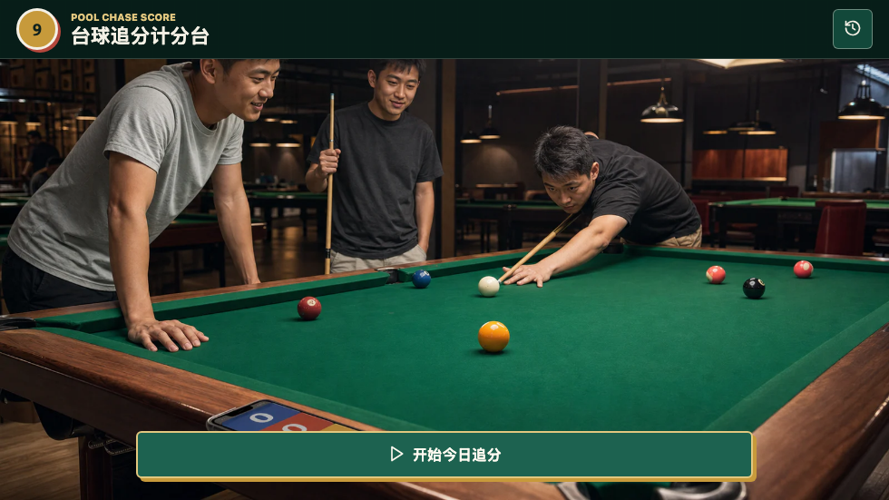

# 台球追分计分台 🎱

台球追分计分台是一款供 **2–6 名球友共用一台手机** 的实时计分 Web 应用。

开始前设置玩家、初始积分、计分事件和上场顺序；开局后只需要先点玩家，再点“犯规”“普胜”“小金”等事件，应用会立即联动增减所有相关玩家的积分。每一局结束后，累计积分会直接带入下一局，直到手动结束本次“今日追分”。

[🎱 在线体验](https://jiaxuan-tao.github.io/vibe-coding-lab/pool-chase-score/) · [🧭 使用方法](#-使用方法) · [🔒 数据与隐私](#-数据与隐私)



---

## 🎯 它解决什么问题

多人打台球追分时，纸笔或聊天记录很容易出现漏记、算错和不知道上一笔是谁操作的问题，尤其是局中犯规需要立刻扣分，不能等整局结束再统一结算。

这个工具把计分拆成四个明确动作：

1. 开始“今日追分”时一次性设置玩家和规则。
2. 每局开始前确认上场顺序。
3. 先点发生事件的玩家，再点对应计分事件。
4. 终局事件自动结束本局，确认下一局顺序后继续累计。

所有事件都以零和方式联动结算：有人加分时，关联玩家会同时扣除对应分数，总积分保持不变。

## 🧭 使用方法

### 开始今日追分

1. 添加 2–6 名玩家并修改姓名，默认提供 3 人。
2. 选择全员从 100、0 分开始，或分别设置初始积分。
3. 使用默认 `1 / 4 / 7 / 10` 模板，或从空白规则开始编辑。
4. 调整第一局上场顺序，点击“开始第 1 局”。

规则只在开始前设置一次，之后每一局沿用同一份快照，避免中途改规则造成前后口径不一致。

### 实时计分

1. 点击当前事件对应的玩家，他的计分行会被突出显示。
2. 点击一个局内事件或本局结果。
3. 如果是一对一转分，继续选择主要负方。
4. 分数立即联动更新，操作记录出现在“本局记录”中。

局内事件不会结束当前局；终局事件完成结算后会自动打开本局结果面板。

### 修正误操作

- 点击“撤销上一步”可以撤回最近一次有效计分，并可立即恢复。
- 点击本局记录可以修改事件类型或删除该条记录。
- 终局结果被撤销后，当前局会重新打开，不会误进下一局。
- 无法继续的牌局可以选择“作废并结束本局”，该局内已有分数会一并回退。

### 继续下一局或结束

终局后会按照“主要得分者、主要负方、其余玩家”的顺序生成下一局建议，也可以手动调整。点击“开始下一局”后，当前累计积分原样保留。

一整场活动结束时，点击右上角更多操作并选择“结束今日追分”。最终排名会保存到本机历史记录，并可生成分享图片。

## ⚙️ 默认计分模板

| 事件 | 默认分值 | 结算方式 | 是否结束本局 |
| --- | ---: | --- | --- |
| 犯规 | 1 | 当前玩家扣分，转给顺序中的上家 | 否 |
| 普胜 | 4 | 主要负方向得分者转分 | 是 |
| 小金 | 7 | 主要负方向得分者转分 | 是 |
| 大金 | 10 | 其余每名玩家分别向得分者转分 | 是 |
| 黄金九 | 4 | 其余每名玩家分别向得分者转分 | 是 |

`1 / 4 / 7 / 10` 只是便于直接体验的默认模板，不代表所有地区或球房都采用同一套规则。事件名称、分值、结算方式和是否终局都可以在开始前修改，也可以使用空白模板自建规则。

## ✨ 核心功能

- 🎱 支持 2–6 人，默认 3 人，玩家姓名和初始积分可编辑。
- 🧮 每个事件自动联动相关玩家，保证总积分守恒。
- ⏱️ 犯规等局内事件实时记分，无需等一局结束。
- 🏆 终局事件自动封局，并生成下一局建议顺序。
- ↩️ 支持撤销、恢复、修改、删除和整局作废。
- 🔁 多局累计计分，规则在同一次活动中保持一致。
- 💾 刷新或意外关闭页面后可以继续当前活动。
- 📚 历史记录保存在本机，支持查看排名和删除。
- 📤 最终结果可调用系统分享，或下载为成绩图片。
- 📱 移动端一屏计分，2–6 人和低高度横屏均经过浏览器回归。
- 📴 安装为 Web App 后支持离线打开和继续计分。

## 🔒 数据与隐私

项目没有账号、后端、数据库和用户分析服务。

当前活动、球友姓名、规则和历史成绩只保存在当前浏览器的 `localStorage` 中，不会上传到服务器。清理浏览器站点数据后，这些记录也会一并删除。

## 🛠️ 本地运行

项目采用原生 HTML、CSS 和 JavaScript，没有构建步骤。

```bash
git clone https://github.com/jiaxuan-tao/vibe-coding-lab.git
cd vibe-coding-lab/pool-chase-score
python3 -m http.server 5177 --bind 127.0.0.1 --directory ..
```

然后打开 [http://127.0.0.1:5177/pool-chase-score/](http://127.0.0.1:5177/pool-chase-score/)。

运行自动测试：

```bash
npm ci
npm test
npm run test:browser
```

## 🧱 技术实现

- **页面与交互**：HTML、CSS、Vanilla JavaScript
- **计分模型**：事件溯源，每次得分由不可变事件推导
- **规则引擎**：顺序转分、一对一转分、其余玩家各付三种结算方式
- **本地数据**：带版本校验、损坏备份和数量上限的 `localStorage`
- **分享结果**：Canvas 生成本地成绩图片
- **离线能力**：Web App Manifest 与 Service Worker 应用壳缓存
- **自动测试**：Node.js 原生测试运行器与 Playwright 多视口浏览器回归
- **部署方式**：GitHub Pages

## 📁 项目结构

```text
.
├── index.html              # 首页、设置、计分、历史和弹层结构
├── styles.css              # 台球房视觉、响应式布局与状态样式
├── app.js                  # 页面状态、交互流程和分享图片
├── rules.js                # 可编辑规则校验与零和结算引擎
├── session.js              # 活动、局、计分事件和撤销状态机
├── storage.js              # 本地存储、异常恢复与历史归档
├── icons.js                # 本地 Lucide 图标子集
├── manifest.webmanifest    # 可安装 Web App 配置
├── sw.js                   # 离线应用壳缓存
├── assets/                 # 首页视觉与应用图标
├── docs/images/            # 项目预览图
└── tests/                  # 规则、会话、存储、界面与浏览器测试
```

## ⚠️ 能力边界

- 追分玩法没有全国统一的唯一计分标准，请在开始前按实际约定确认规则。
- 应用不知道当前击球者是谁，玩家选择代表“这次事件记到谁名下”，不会自动跟踪轮次。
- 上场顺序用于相邻玩家结算和下一局建议，不代替现场比赛裁判。
- 数据仅保存在当前浏览器，没有跨设备同步和云端备份。
- 项目只记录游戏积分，不提供金额换算、付款或输赢结算功能。

## 🤖 AI 辅助开发说明

项目通过 Vibe Coding 方式完成。作者负责产品范围、计分口径、交互决策和最终验收，Codex 用于辅助实现、自动测试、视觉检查与部署。

## 📄 开源许可

[MIT License](LICENSE) © 2026 Jiaxuan Tao
